# Introduction

Single-cell RNA-sequencing is a rapidly growing field that allows one to see which genes are expressed in subsets of a tissue or particular cell types rather than just in aggregate.

10X Genomics has a very useful protocol for performing single-cell RNA-seq at high throughput. This protocol may be combined with cell hashing, which uses an oligo-tagged antibody to label each cell with its sample of origin, to sequence cells from multiple different samples all at once (Stoeckius et al., 2018).

In a typical cell hashing experiment, the 10X instrument is "super-loaded" with a very high concentration of cells, which results in an expected number of cells of around 20,000 singlets and 5,000 multiplets. As opposed to in an experiment without super-loading, this means that the number of cells is relatively fixed. Therefore rather than trying to trade off the number of cells vs. number of reads per cell given a fixed sequencing cost, the question becomes how much we can minimize sequencing cost while still determining the same biology from a fixed number of cells.

Another consideration is maximimizing the use of the flow cell. An Illumina S4 flow cell for the NovaSeq sequencer is estimated to produce 2-2.5 billion fragments per lane [(Illumina)](https://www.illumina.com/systems/sequencing-platforms/novaseq/specifications.html). However, multiplexing allows these reads to be divided among multiple pools of cells. Given a large number of cells to process, it would be beneficial to maximize the number of pools that can be run on one lane.

Combining 4 pools per lane would give an average number of reads per cell barcode of at least 20,000 for a cell hashing experiment (2e9/((20000+5000)*4)). This fits with the 10X Genomics minimum recommendation [(10X Genomics)](https://kb.10xgenomics.com/hc/en-us/articles/115002022743-What-is-the-recommended-sequencing-depth-for-Single-Cell-3-and-5-Gene-Expression-libraries-). We were curious if we could potentially increase the number of pools per lane even further, perhaps to say 8 pools per lane (for an average number of reads per cell of 10,000).

In this post, we seek to use published data to compare cell type identification from a very deeply sequenced pool of cells (over 75,000 average reads per cell) to various levels of more shallow sequencing. For this analysis, we assume that random downsampling of the raw reads (FASTQs) provides an adequate simulation of lower sequencing depth. Then, we compare clustering results from Seurat (Stuart & Butler 2019) to quantify how similar or distinct cell type identification is between different levels of sequencing.

A major research area of the New York Genome Center is neuropsychiatric and neurodegenerative disease, so we chose a dataset of neurons to best match the single-cell or single-neuron samples that we might encounter as part of this research in the future. The dataset we used contains over 5,000 cells from a combined cortex, hippocampus, and subventricular zone of an E18 mouse. Libraries were prepared using 10X Genomics latest "Next GEM" kit. This data is available for download in the "datasets" section of the 10X Genomics website [(5k mouse neurons, Next GEM kit)](https://support.10xgenomics.com/single-cell-gene-expression/datasets/3.0.2/5k_neuron_v3_nextgem?src=search&lss=google&cnm=sem-goog-2020-website-page-ra_g-p_brand-amr&cid=7011P000000oWx1).

# Analysis

## Downsampling the raw data

After downloading and unpacking the FASTQ tarball, the following FASTQs were located under sub-directory 5k_neuron_v3_nextgem_fastqs.

	5k_neuron_v3_nextgem_S1_L001_I1_001.fastq.gz
	5k_neuron_v3_nextgem_S1_L001_R1_001.fastq.gz
	5k_neuron_v3_nextgem_S1_L001_R2_001.fastq.gz
	5k_neuron_v3_nextgem_S1_L002_I1_001.fastq.gz
	5k_neuron_v3_nextgem_S1_L002_R1_001.fastq.gz
	5k_neuron_v3_nextgem_S1_L002_R2_001.fastq.gz
	5k_neuron_v3_nextgem_S1_L003_I1_001.fastq.gz
	5k_neuron_v3_nextgem_S1_L003_R1_001.fastq.gz
	5k_neuron_v3_nextgem_S1_L003_R2_001.fastq.gz
	5k_neuron_v3_nextgem_S1_L004_I1_001.fastq.gz
	5k_neuron_v3_nextgem_S1_L004_R1_001.fastq.gz
	5k_neuron_v3_nextgem_S1_L004_R2_001.fastq.gz

To subsample these files, we used dcjones' subsample package, "a small, Unix-y program to efficiently subsample lines from a file without replacement" [(subsample package Github)](https://github.com/dcjones/subsample). 

The original data had 78,597 mean reads per cell. We decided to test average read numbers per cell of 10, 25, and 50,000. This would mean that we would want to test downsample levels of 13, 32, and 64%. We ended up testing 65% instead of 64%, but otherwise we applied these three levels of downsampling.

Count exact number of reads per lane before start actual downsampling. Would run this for each of L001,2,3, and 4.

    zcat 5k_neuron_v3_nextgem_fastqs/5k_neuron_v3_nextgem_S1_${lane}_I1_001.fastq.gz | wc -l | awk '{print $1/4}' > ${lane}_read_count.txt

Unzip all FASTQs under 5k_neuron_v3_nextgem_fastqs.

	for file in 5k_neuron_v3_nextgem_fastqs/*.gz;do gunzip $file;done

After that, here is the shell script code to run downsampling given a type of FASTQ to downsample (I1, R1, or R2), a lane number (L001,2,3, or 4), and a percent downsample (13,32,or 65).

	#Get variables from command line arguments.

	type=$1
	lane=$2
	downsample=$3

	#Get exact number of reads to select for downsample.

	full_lane_reads=`cat ${lane}_read_count.txt`
	num_reads=`echo $downsample $full_lane_reads | awk '{printf("%.0f",($1/100)*$2)}'`

	#Create output directory if it does not exist already.
	
	if [ ! -e downsample_pct_${downsample}_fastqs ]
	then
	mkdir downsample_pct_${downsample}_fastqs
	fi

	#Run subsample.
	#Use seed so that same reads are selected for I1, R1, and R2 from the same lane.
	#Seed 1392 was used for this analysis.

	subsample -k 4 -n $num_reads -s 1392 5k_neuron_v3_nextgem_fastqs/5k_neuron_v3_nextgem_S1_${lane}_${type}_001.fastq > downsample_pct_${downsample}_fastqs/downsample_pct_${downsample}_S1_${lane}_${type}_001.fastq

	#Zip up output file.
	
	gzip downsample_pct_${downsample}_fastqs/downsample_pct_${downsample}_S1_${lane}_${type}_001.fastq

Finally, the full data FASTQs were zipped back up as well.

	for file in 5k_neuron_v3_nextgem_fastqs/*.fastq;do gzip $file;done

## Get gene-cell count matrix for each downsample.

After this, 10X's CellRanger pipeline was used to get the gene-cell UMI count matrix for each downsample from these FASTQs.

Since we used CellRanger v3.1.0 (vs. the 3.0.2 used for the gene-cell matrix available from the 10X website), we also ran CellRanger on the full data.

We used reference version v3.0.0 (mm10) downloaded from the 10X website as well.

This resulted in the gene-cell UMI count matrix being available under the following paths:

	CellRanger_output/subsamp_13/subsamp_13/outs/filtered_feature_bc_matrix
	CellRanger_output/subsamp_32/subsamp_32/outs/filtered_feature_bc_matrix
	CellRanger_output/subsamp_65/subsamp_65/outs/filtered_feature_bc_matrix
	CellRanger_output/full_data/full_data/outs/filtered_feature_bc_matrix

Unfortunately the 10X software does not provide the option to set a seed, so your output from this step may differ slightly from ours given identical raw data input.

## Run Seurat standard analysis on each downsample.

After this, we ran fairly standard Seurat analysis on each downsample level.

For this analysis, we used Seurat v3.0.1.9015.

Would run the code below using arguments "subsamp_13", "subsamp_32", "subsamp_65", and "full_data".

	#Accept downsample level as command line argument.

	args <- commandArgs(trailingOnly=TRUE)
	downsample_level <- args[1]

	#Load libraries.

	library(Seurat)

	#Read in gene-cell UMI count matrix.

	counts <- Read10X(paste0("CellRanger_output/",downsample_level,"/",downsample_level,"/outs/filtered_feature_bc_matrix"))

	#Create Seurat object.
	#Require genes to be expressed in 10+ cells.

	seurat.obj <- CreateSeuratObject(counts,min.cells=10)

	#Get mitochondrial rates.

	seurat.obj$percent.mito <- PercentageFeatureSet(seurat.obj,pattern="^mt-")

	#Remove cells with >30% mitochondrial rate.

	seurat.obj <- subset(seurat.obj,percent.mito < 30)

	#Remove cells in the bottom 5% by nGene.
	#This results in a cutoff of ~500 using the full dataset.

	nGene_cutoff <- quantile(seurat.obj$nFeature_RNA,probs=.05)

	seurat.obj <- subset(seurat.obj,nFeature_RNA > nGene_cutoff)

	#Removal of low-quality cells complete.
	#Ready to run standard pipeline up to PCA analysis.
	#Again we set seed as appropriate for reproducibility.
	#Got better results with add 1 to the seed for the 13% downsample.

	if(downsample_level != "subsamp_13")
	{
		seurat_seed = 1392
	}

	if(downsample_level == "subsamp_13")
	{
		seurat_seed = 1393
	}

	seurat.obj <- NormalizeData(seurat.obj)
	seurat.obj <- FindVariableFeatures(seurat.obj,selection.method = "mean.var.plot")
	seurat.obj <- ScaleData(seurat.obj,features = VariableFeatures(seurat.obj))
	seurat.obj <- RunPCA(seurat.obj,features = VariableFeatures(seurat.obj),seed.use=seurat_seed)

	#Normally here, would explore the variance explained per PC to choose which PCs to run.
	#However this manual review is not very conducive to automated analysis.
	#So here, we run with the same number of PCs (first 15) for all downsample levels.
	#This should be more than sufficient given the relatively low number of cells here.

	PCs_to_use = 1:15

	seurat.obj <- FindNeighbors(seurat.obj,reduction = "pca",dims = PCs_to_use)
	seurat.obj <- FindClusters(seurat.obj,resolution = 0.6,random.seed=seurat_seed) 
	seurat.obj <- RunUMAP(seurat.obj,reduction = "pca",dims = PCs_to_use,seed.use=seurat_seed)

	#Save Seurat object.

	save(seurat.obj,file=paste0("seurat_object_",downsample_level,".Rdata"))

	#Output clustering results and QC metrics (nUMI and nGene and mito rates) per cell as well.

	write.csv(seurat.obj@meta.data,file=paste0("seurat_metadata_",downsample_level,".csv"),row.names=TRUE,quote=TRUE)

	#Also output UMAP coordinates.

	umap_coords <- Embeddings(seurat.obj,reduction="umap")

	write.csv(umap_coords,file=paste0("seurat_umap_coords_",downsample_level,".csv"),row.names=TRUE,quote=TRUE)

Let's make some UMAP plots to review these results.

For now, let's show for full data and 32% downsample.

	#Accept downsample level as command line argument.

    args <- commandArgs(trailingOnly=TRUE)
    downsample_level <- args[1]

    #Load libraries.

	library(ggplot2)

	#Read in UMAP coordinates and metadata table (includes clusters).

	metadata <- read.csv(paste0("seurat_metadata_",downsample_level,".csv"),row.names=1,header=TRUE,stringsAsFactors=FALSE)
	umap_coords <- read.csv(paste0("seurat_umap_coords_",downsample_level,".csv"),row.names=1,header=TRUE)

	#Set up color vector.

	mycol <- c("#004949","#009292","#FF6DB6","#FFB677","#490092","#006DDB","#B66DFF","#6DB6FF","#B6DBFF","#920000","#924900","#DBD100","#24FF24","#FFFF6D","#000000")

	#Plot.

	png(paste0("seurat_UMAP_",downsample_level,".png"))

	ggplot(data.frame(umap_coords,Cluster = factor(metadata$seurat_clusters)),
		aes(UMAP_1,UMAP_2,colour=Cluster)) +
		geom_point(size=1) +
		scale_colour_manual(values=rep(mycol,times=2)) +
		ggtitle(downsample_level)

	dev.off()

	#Both full data and downsample have three clusters that are extreme outliers compared to the rest.
	#Let's re-plot minus these.
	#Also adjust color vector accordingly.

	if(downsample_level == "full_data")
	{
		outlier_clusters <- c(14,15,17)
		mycol_repped <- rep(mycol,times=2)
		mycol_repped[17] <- mycol[15]
		mycol_repped[c(15,16,18)] <- "#999999"
	}

	if(downsample_level == "subsamp_32")
	{
		outlier_clusters <- c(15,16,17)
		mycol_repped[16:18] <- "#999999"
	}

	new_xlim <- quantile(umap_coords[!(metadata$seurat_clusters %in% outlier_clusters),1],probs=c(.001,.999))
	new_ylim <- quantile(umap_coords[!(metadata$seurat_clusters %in% outlier_clusters),2],probs=c(.001,.999))

	png(paste0("seurat_UMAP_",downsample_level,"_trunc_axes.png"))

	ggplot(data.frame(umap_coords,Cluster = factor(metadata$seurat_clusters)),
        aes(UMAP_1,UMAP_2,colour=Cluster)) +
        geom_point(size=1) +
        scale_colour_manual(values=mycol_repped) +
        ggtitle(paste0(downsample_level," minus outlier clusters")) + 
		coord_cartesian(xlim=new_xlim,ylim=new_ylim)

	dev.off()

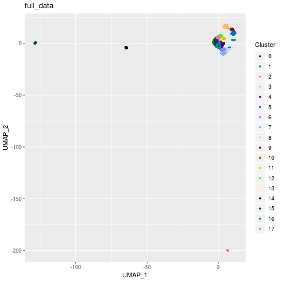
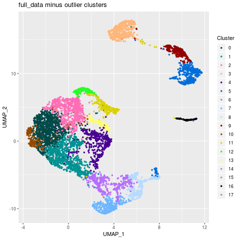
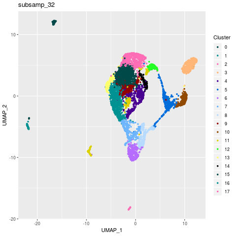
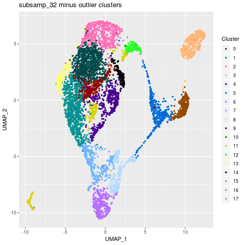

Everything else looks fine, but cluster 11 in the 32% downsample data looks very strange!

I tried playing around with settings, and was ultimately able to resolve the part of this cluster that appears separate on the UMAP plot by switching to 50 PCs instead of 15, and running FindNeighbors with prune.SNN=0 instead of the default of 1/15.

These results are saved in files seurat_object_subsamp_32_increase_PCs_no_prune_SNN.Rdata, seurat_metadata_subsamp_32_increase_PCs_no_prune_SNN.csv, and seurat_umap_coords_subsamp_32_increase_PCs_no_prune_SNN.csv.

## Compare clustering results between downsamples.

Now, let's compare clustering results based on percentage of cells from each cluster assigned to new clusters for the full data vs. the 32% downsample.

	library(pheatmap)

	row_data <- read.csv("seurat_metadata_full_data.csv",header=TRUE,row.names=1,stringsAsFactors=FALSE)

	col_data <- read.csv("seurat_metadata_subsamp_32.csv",header=TRUE,row.names=1,stringsAsFactors=FALSE)
	col_data <- col_data[intersect(rownames(row_data),rownames(col_data)),]
	row_data_matched <- row_data[intersect(rownames(row_data),rownames(col_data)),]
	
	row_vs_col_data <- table(row_data_matched$seurat_clusters,col_data$seurat_clusters)
	row_vs_col_data <- sweep(row_vs_col_data*100,1,rowSums(row_vs_col_data),FUN="/")

	rownames(row_vs_col_data) <- paste0("Full_",rownames(row_vs_col_data))
	colnames(row_vs_col_data) <- paste0("Subsamp_",colnames(row_vs_col_data))

	pheatmap(row_vs_col_data,
		cluster_rows=FALSE,cluster_cols=FALSE,
		file="clusters_full_vs_subsamp_32_no_reorder.png",
		main="Percent cells from full data clusters in downsample clusters")
	pheatmap(row_vs_col_data[,paste0("Subsamp_",c(0:5,7,6,8,10,9,11,12,14,15,16,17,13))],
		cluster_rows=FALSE,cluster_cols=FALSE,
		file="clusters_full_vs_subsamp_32_with_reorder.png",
		main="Same but with reorder clusters to show match-up")

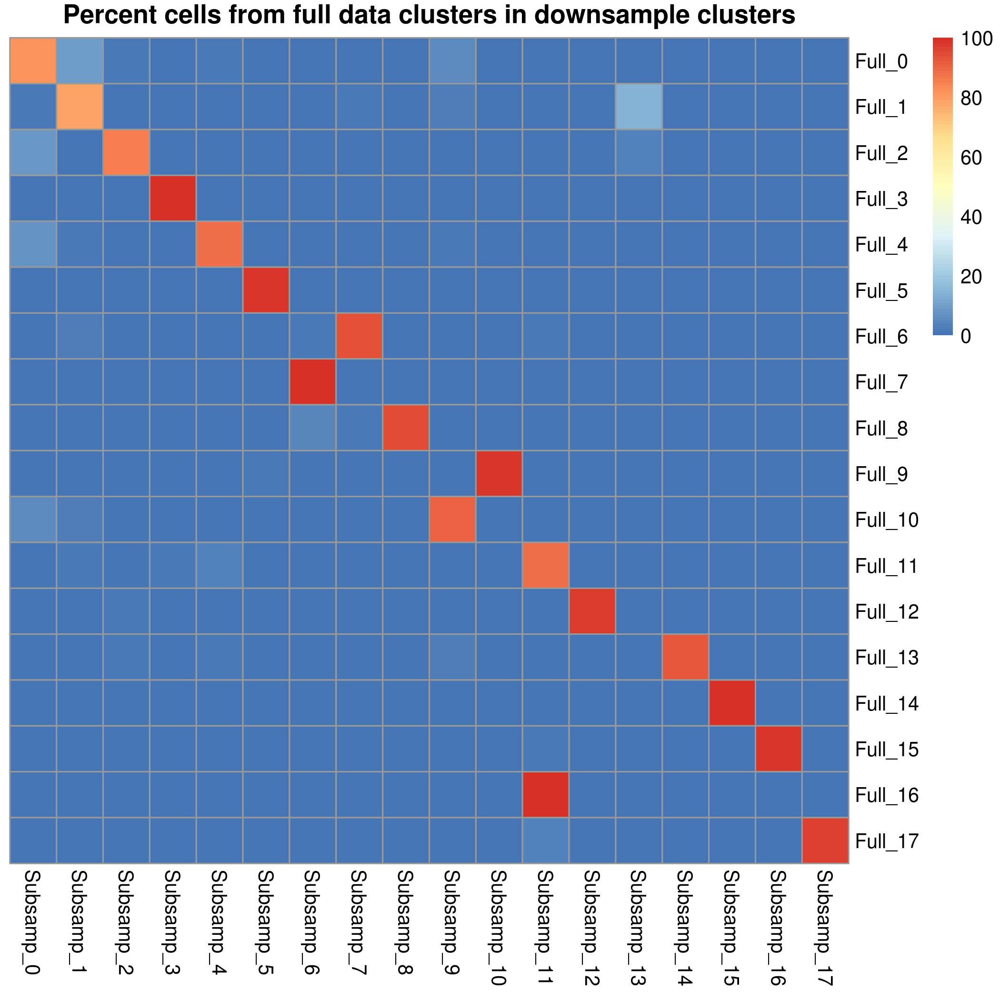
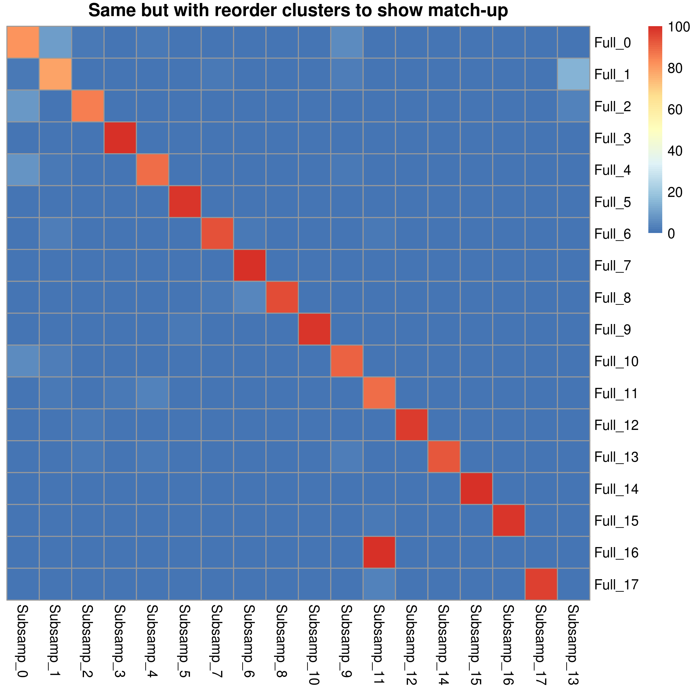

We find that all clusters from the full data except cluster 16 have a 1-1 match-up with the clusters in the 32% downsample.

What about if we compare the results from the 32% downsample where we increased number of PCs and ran clustering without pruning the SNN graph?

	library(pheatmap)

	row_data <- read.csv("seurat_metadata_full_data.csv",header=TRUE,row.names=1,stringsAsFactors=FALSE)
	
	col_data <- read.csv("seurat_metadata_subsamp_32_increase_PCs_no_prune_SNN.csv",header=TRUE,row.names=1,stringsAsFactors=FALSE)
	col_data <- col_data[intersect(rownames(row_data),rownames(col_data)),]
	row_data_matched <- row_data[intersect(rownames(row_data),rownames(col_data)),]

	row_vs_col_data <- table(row_data_matched$seurat_clusters,col_data$seurat_clusters)
    row_vs_col_data <- sweep(row_vs_col_data*100,1,rowSums(row_vs_col_data),FUN="/")

    rownames(row_vs_col_data) <- paste0("Full_",rownames(row_vs_col_data))
    colnames(row_vs_col_data) <- paste0("Subsamp_",colnames(row_vs_col_data))

	pheatmap(row_vs_col_data,
		cluster_rows=FALSE,cluster_cols=FALSE,
		file="clusters_full_vs_subsamp_32_different_cluster_settings.png",
		main="Percent cells from full data clusters in downsample clusters\nw/ 50 PCs, prune.SNN=0") 

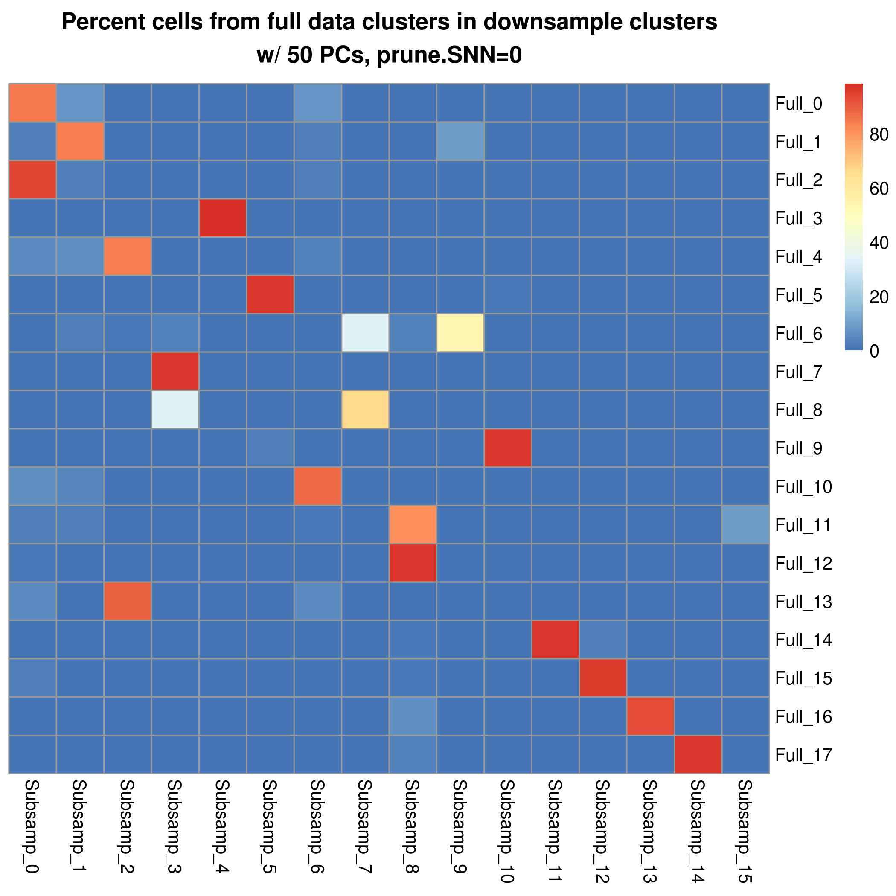

The downsample clusters overall look not as good, with worse match-up to the full data.

Importantly, though, we are able to resolve the previously missing full data cluster 16 this way, as this cluster is now also distinct in the downsample data.

Now, let's move on to looking at the 13% downsample data.

	library(pheatmap)

    row_data <- read.csv("seurat_metadata_full_data.csv",header=TRUE,row.names=1,stringsAsFactors=FALSE)

    col_data <- read.csv("seurat_metadata_subsamp_13.csv",header=TRUE,row.names=1,stringsAsFactors=FALSE)
    col_data <- col_data[intersect(rownames(row_data),rownames(col_data)),]
    row_data_matched <- row_data[intersect(rownames(row_data),rownames(col_data)),]

    row_vs_col_data <- table(row_data_matched$seurat_clusters,col_data$seurat_clusters)
    row_vs_col_data <- sweep(row_vs_col_data*100,1,rowSums(row_vs_col_data),FUN="/")

    rownames(row_vs_col_data) <- paste0("Full_",rownames(row_vs_col_data))
    colnames(row_vs_col_data) <- paste0("Subsamp_",colnames(row_vs_col_data))

    pheatmap(row_vs_col_data,
        cluster_rows=FALSE,cluster_cols=FALSE,
        file="clusters_full_vs_subsamp_13_no_reorder.png",
        main="Percent cells from full data clusters in 13% downsample clusters")
	pheatmap(row_vs_col_data[,paste0("Subsamp_",c(0,1,5,3,2,4,6,8,7,11,9,10,13:16,12))],
		cluster_rows=FALSE,cluster_cols=FALSE,
		file="clusters_full_vs_subsamp_13_with_reorder.png",
		main="Same but with reorder clusters to show match-up")

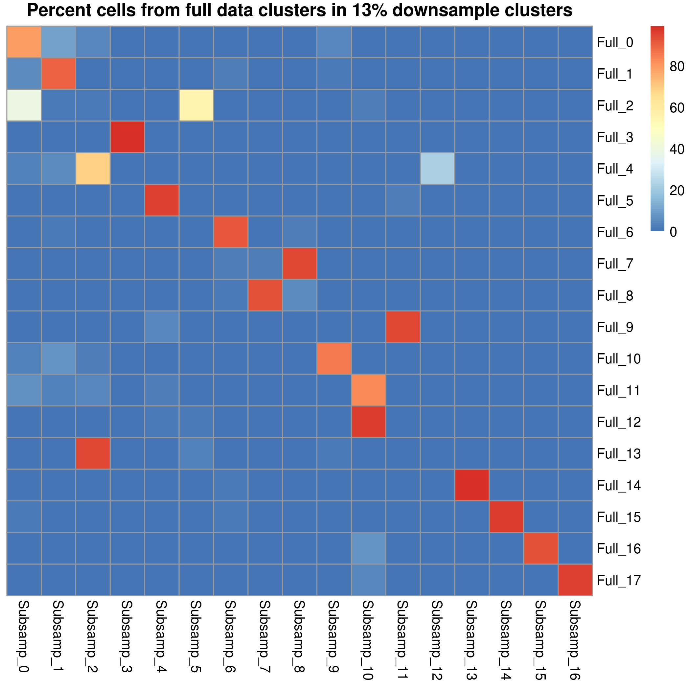
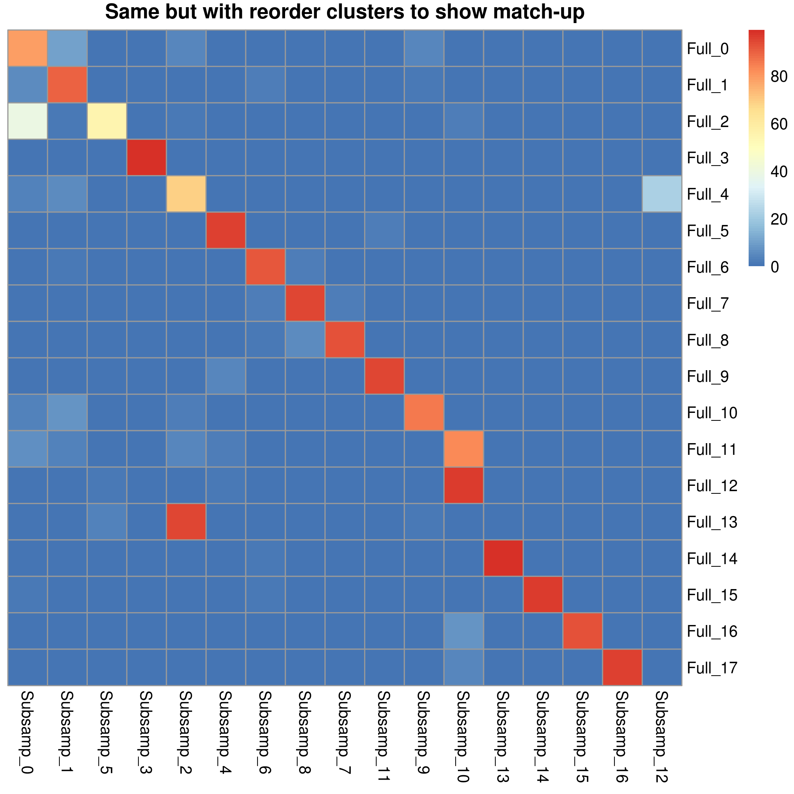

Looks like we lose clusters 12 and 13 going down to the 13% downsample, at least with running Seurat using identical settings.

However, I did try running Seurat on the 13% downsample using exact same parameters, except this time set resolution=1.2 for FindClusters.

These results are saved in seurat_metadata_subsamp_13_highres.csv. Let's compare these results now to the full data.

	library(pheatmap)

	row_data <- read.csv("seurat_metadata_full_data.csv",header=TRUE,row.names=1,stringsAsFactors=FALSE)

	col_data <- read.csv("seurat_metadata_subsamp_13_highres.csv",header=TRUE,row.names=1,stringsAsFactors=FALSE)
	col_data <- col_data[intersect(rownames(row_data),rownames(col_data)),]
	row_data_matched <- row_data[intersect(rownames(row_data),rownames(col_data)),]

	row_vs_col_data <- table(row_data_matched$seurat_clusters,col_data$seurat_clusters)
    row_vs_col_data <- sweep(row_vs_col_data*100,1,rowSums(row_vs_col_data),FUN="/")

    rownames(row_vs_col_data) <- paste0("Full_",rownames(row_vs_col_data))
    colnames(row_vs_col_data) <- paste0("Subsamp_",colnames(row_vs_col_data))

	pheatmap(row_vs_col_data,
		cluster_rows=FALSE,cluster_cols=FALSE,
		file="clusters_full_vs_subsamp_13_highres_no_reorder.png",
		main="Percent cells from full data clusters in 13% downsample high-res clusters")

	pheatmap(row_vs_col_data[,paste0("Subsamp_",c(0,1,6,3,5,4,7,8,12,11,9,18,13,14,17,19,20,21,2,10,15,16))],		
		cluster_rows=FALSE,cluster_cols=FALSE,
		file="clusters_full_vs_subsamp_13_highres_with_reorder.png",
		main="Same but with reorder clusters to show match-up")

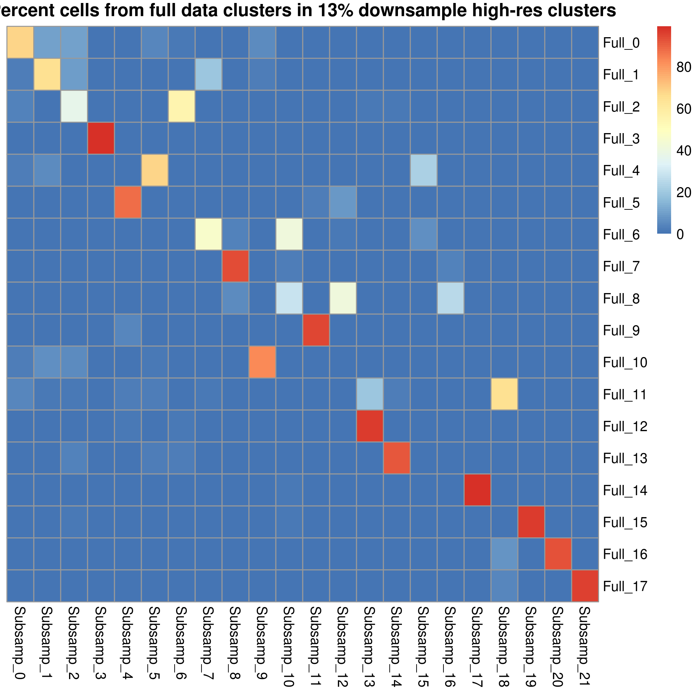
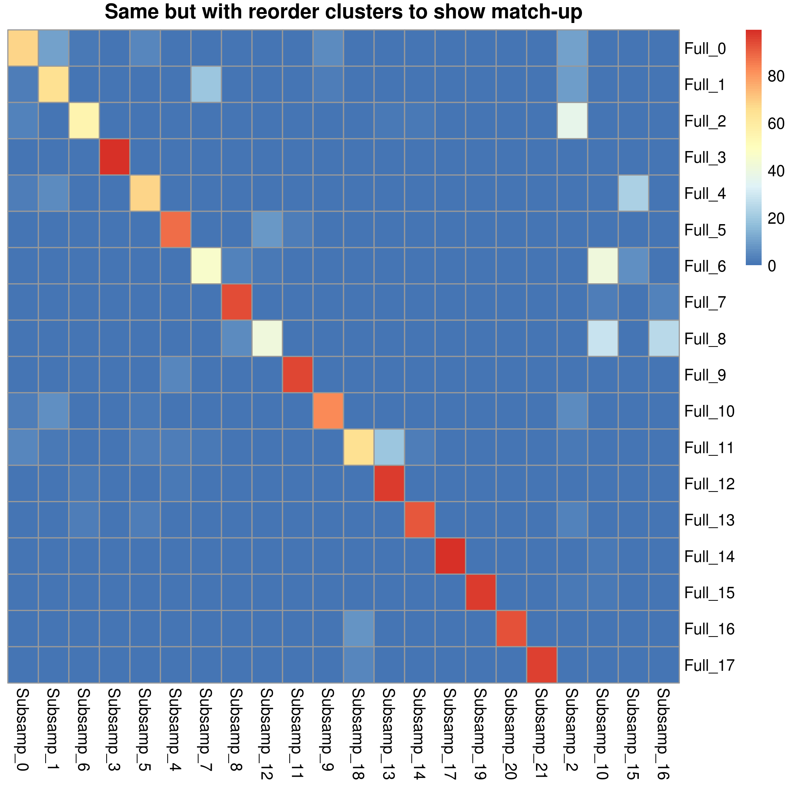

Overall the higher resolution is not the best, as it creates some extra clusters that were not there in the full data.

However, this shows that we actually do also find clusters 12 and 13 from the full data in the 13% downsample, although it requires playing around with Seurat parameters a bit.

# Conclusions

It appears from this analysis that even with only half the recommended reads per cell, we were able to reproduce the same cell types as found with much greater sequencing depth. However, this comes with some important assumptions.

In particular, it is important to note that certain cell types from the full dataset were only found in the downsampled data after changing certain parameters in Seurat from their defaults. In a real-world scenario, where one would not have the full dataset available as a reference, you would not necessarily know that these parameters required tweaks unless you had some other reference (like an underlying knowledge of the biology) to know which cell types were missing. 

For the change of resolution parameter in the 13% downsample, this is a fairly standard parameter to try to optimize in a Seurat workflow. It is common to test different values for this parameter to see if any additional interesting cell types appear at higher resolution. So it is fairly likely that all cell types would have been found in this data even if the analyst did not have any knowledge of the underlying biology.

However, the 32% downsample required extensive non-standard changes to parameters in order to obtain all clusters from the full data. Adjusting the pruning of the shared nearest neighbor graph is not typically done unless something is seen as "wrong" with the clustering, as we had here. Although the discrepancy between the UMAP coordinates and the cluster IDs might raise flags here, it could be possible that this cell type may have been missed in the 32% downsample given a standard workflow.

The fact that the 13% but not the 32% downsample was able to find all cell types using only standard parameter changes also highlights the stochastic nature of this downsampling experiment, and RNA-seq in general. It is possible that a different 32% downsample might have showed better performance.

Another limitation of this experiment is that we did not test differential expression between clusters, only consistency of clusters. If one were interested in finding marker genes of each cell type, it is possible and in fact likely that deeper sequencing would provide a greater ability to characterize the expression signature of cell types.

Still, this analysis is very promising in its suggestion that one can still gain quite a lot of the same information while minimizing sequencing costs to quite low levels. It would be very interesting to see if we obtain similar results analyzing other datasets, including other cell types besides embryonic mouse neurons.

# References

Stoeckius, M., Zheng, S., Houck-Loomis, B. et al. Cell Hashing with barcoded antibodies enables multiplexing and doublet detection for single cell genomics. Genome Biol 19, 224 (2018). https://doi.org/10.1186/s13059-018-1603-1

Stuart, T., Butler, A., Hoffman P., et al. Comprehensive Integration of Single-cell Data. Cell 177, 7 (2019). https://doi.org/10.1016/j.cell.2019.05.031
